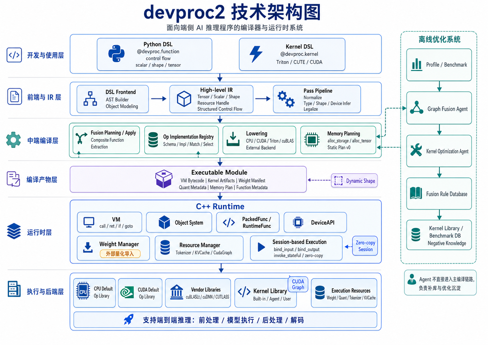

# devproc2 Design Overview：面向端侧 AI 推理程序的编译器与运行时系统


## 1. 背景与定位
### 1.1 背景

devproc1 已经验证了一个重要方向：端侧推理链路不应该只关注模型主干，而应该把前处理、模型执行、后处理、runtime 调度和高性能 kernel 接入放到同一个系统里统一设计。

但是 devproc1 也暴露出几个问题：

- runtime 复杂度容易失控；
- 前端、IR、后端、runtime 的边界不够清晰；
- kernel 接入能力还不够系统化；
- 默认算子能力和高性能特化能力之间缺少统一机制；
- 前后处理、tokenizer、KVCache、weight、quantization 等真实推理资源没有形成统一抽象；
- 自动优化如果只依赖传统 loop-style schedule，很难持续追上手写 SOTA kernel。

因此，devproc2 的目标不是对 devproc1 做局部重构，而是升级为一个完整的编译器与运行时系统。

### 1.2 一句话定位

**devproc2 是一个面向端侧 AI 推理程序的完整编译器与运行时系统。它编译的不是单纯 tensor graph，而是完整推理程序。**

完整推理程序包括：

- 前处理；
- tokenizer；
- tensor compute；
- 模型主干；
- 权重与量化权重绑定；
- KVCache；
- 投机采样；
- 后处理；
- zero-copy 输入输出；
- CUDA Graph；
- runtime resource 管理；
- 自定义 kernel 与 agent-generated kernel。

### 1.3 核心目标

devproc2 的核心目标是：

1. 使用 Python DSL 表达完整端侧推理程序；
2. 支持结构化 control flow；
3. 支持 Triton / CUTE DSL 等 kernel DSL 的无感接入；
4. 通过中端 IR 和 pass 完成类型、shape、device、memory、lowering 与 execution plan 分析；
5. 通过默认算子库保证基础覆盖率和稳定性能；
6. 通过 agent 离线优化系统补充 Fusion Rule Database 和 Kernel Library；
7. 通过 C++ VM runtime、Object System、PackedFunc、DeviceAPI、Memory Planner 和 Session-based zero-copy execution 支持真实端侧部署。

---

## 2. 总体架构

### 2.1 系统总览

```text
┌──────────────────────────────────────────────────────────────┐
│                        Python DSL                             │
│ @devproc.function | @devproc.kernel | control flow | scalar   │
└──────────────────────────────────────────────────────────────┘
                              ↓
┌──────────────────────────────────────────────────────────────┐
│                      Compiler Frontend                        │
│ AST builder | DSL capture | kernel capture | object modeling  │
└──────────────────────────────────────────────────────────────┘
                              ↓
┌──────────────────────────────────────────────────────────────┐
│                        Middle-end IR                          │
│ tensor | scalar | object | shape | control flow | resource    │
└──────────────────────────────────────────────────────────────┘
                              ↓
┌──────────────────────────────────────────────────────────────┐
│                         Pass Pipeline                         │
│ normalize | infer | legalize | fusion | lowering | memory     │
└──────────────────────────────────────────────────────────────┘
                              ↓
┌──────────────────────────────────────────────────────────────┐
│                     Lowering Framework                        │
│ CPU | Triton | CUTE | cuBLAS | TensorRT | Tokenizer | External│
└──────────────────────────────────────────────────────────────┘
                              ↓
┌──────────────────────────────────────────────────────────────┐
│                    Executable Module                          │
│ VM bytecode | kernel artifacts | weight map | metadata        │
└──────────────────────────────────────────────────────────────┘
                              ↓
┌──────────────────────────────────────────────────────────────┐
│                         C++ Runtime                           │
│ VM | Object | PackedFunc | DeviceAPI | Memory | ResourceMgr   │
└──────────────────────────────────────────────────────────────┘
                              ↓
┌──────────────────────────────────────────────────────────────┐
│                         Execution                             │
│ CPU ops | CUDA kernels | CUDA Graph | model engine | KVCache  │
└──────────────────────────────────────────────────────────────┘
```

### 2.2 一级模块

建议 devproc2 分成以下一级模块：

```text
devproc2
  ├── frontend
  │   ├── Python DSL
  │   ├── @devproc.function
  │   ├── @devproc.kernel
  │   └── control flow capture
  │
  ├── ir
  │   ├── function / block / value / call
  │   ├── tensor / scalar / shape / object
  │   ├── structured control flow
  │   └── resource handle
  │
  ├── passes
  │   ├── normalize
  │   ├── type / shape / device infer
  │   ├── legalize
  │   ├── fusion planning / apply
  │   ├── op lowering
  │   ├── memory planning
  │   └── VM codegen
  │
  ├── op
  │   ├── Op Schema Registry
  │   ├── Op Implementation Registry
  │   ├── Default Operator Library
  │   └── Kernel Library
  │
  ├── runtime
  │   ├── VM
  │   ├── Object System
  │   ├── PackedFunc / RuntimeFunc
  │   ├── DeviceAPI
  │   ├── Memory Manager
  │   ├── Resource Manager
  │   └── Session-based execution
  │
  ├── model
  │   ├── Weight Manager
  │   ├── Quantization Import
  │   ├── Weight Mapping
  │   ├── KVCache
  │   └── Tokenizer
  │
  └── optimize
      ├── Fusion Rule Database
      ├── Kernel Library
      ├── Agent Optimization System
      ├── Benchmark DB
      └── Verification Harness
```

---

## 3. Python DSL Frontend

### 3.1 DSL 目标

devproc2 的 Python DSL 负责表达端到端推理程序，而不是只表达 tensor graph。

它需要支持：

- tensor 操作；
- scalar 操作；
- shape 表达；
- control flow；
- model call；
- tokenizer call；
- KVCache 操作；
- runtime resource handle；
- `@devproc.kernel` 直接调用。

### 3.2 `@devproc.function`

`@devproc.function` 用于定义可编译的推理程序。

示意：

```python
@devproc.function
def pipeline(image_bytes, text, model, tokenizer):
    image = decode_image(image_bytes).on("cpu")
    image = resize(image, 224, 224).on("cpu")
    image = normalize(image).on("cuda")

    tokens = tokenizer.encode(text).on("cpu")
    logits = model(image, tokens).on("cuda")
    result = postprocess(logits).on("cpu")
    return result
```

这类程序中包含：

- 非 tensor 输入；
- tensor op；
- CPU / CUDA 混合执行；
- external function；
- model resource；
- tokenizer resource；
- 前后处理逻辑。

### 3.3 Control Flow

devproc2 DSL 需要支持结构化 control flow：

- `if / else`；
- `while`；
- `for`；
- `return`。

前端应优先生成结构化 IR，而不是直接生成低级 CFG / goto。

示意：

```python
@devproc.function
def f(x, y, cond):
    if cond:
        z = x + y
    else:
        z = x * y
    return relu(z)
```

High-level IR 可以保留 `IfOp`，最后再 lower 到 VM 的 `if/goto`。

### 3.4 `@devproc.kernel`

`@devproc.kernel` 是 devproc2 的一等公民。

目标是让 Triton / CUTE DSL / CUDA kernel 能像普通 DSL 函数一样被调用。

```python
@devproc.kernel(target="triton")
def fused_rmsnorm_kernel(...):
    ...

@devproc.function
def forward(x, weight):
    y = fused_rmsnorm_kernel(x, weight)
    return y
```

从用户视角：

```text
kernel 就像普通 devproc op 一样调用
```

从编译器视角：

```text
@devproc.kernel
  → Kernel Object
  → IR callable
  → AOT compile
  → Kernel artifact
  → Kernel Registry
  → Runtime launcher
```

---

## 4. IR 与中端 Pass

### 4.1 IR 定位

devproc2 的中端 IR 需要表达完整推理程序语义。

它不仅要表达 tensor value，还要表达：

- scalar value；
- shape value；
- object handle；
- resource handle；
- control flow；
- external call；
- model call；
- kernel call。

### 4.2 Value 与 Resource

建议区分两类东西：

```text
Value:
  Tensor
  Scalar
  Shape
  Tuple

Resource:
  Weight
  Tokenizer
  KVCache
  ModelEngine
  CudaGraph
  RuntimeModule
```

Value 更适合 SSA 和数据流分析。

Resource 是 runtime 持有的对象，可以在 IR 中以 handle 的形式流动。

### 4.3 Pass Pipeline

建议的主编译 pipeline：

```text
Python DSL
  ↓
High-level IR
  ↓
Normalize
  ↓
Type / Shape / Device Infer
  ↓
Legalize
  ↓
FusionPlanningPass
  ↓
FusionApplyPass
  ↓
Op Lowering
  ↓
Memory Planning
  ↓
Control Flow Lowering
  ↓
VM Codegen
  ↓
Executable Module
```

### 4.4 Dynamic Shape

devproc2 必须支持动态 shape，但需要分层设计：

```text
Symbolic Shape in IR
Runtime Shape Value
Shape Bucket
Dynamic Memory Strategy
```

建议区分：

- static dim；
- symbolic dim；
- bounded dynamic dim；
- runtime dim；
- shape bucket。

动态 shape 会影响：

- shape inference；
- op lowering；
- kernel selection；
- memory planning；
- CUDA Graph；
- KVCache；
- zero-copy output binding。

因此，动态 shape 不应该只是 shape inference 的局部功能，而应该是贯穿 compiler/runtime 的系统设计。

### 4.5 Fusion 设计

devproc2 可以借鉴 TVM 的 composite function 思路。

融合结果不一定要表现为一个真实的 `FusedOp` 节点，而可以表现为一个被提取出来的 composite function。

示意：

```text
原始 IR:

%0 = matmul(%x, %w)
%1 = add(%0, %bias)
%2 = silu(%1)

融合后:

%2 = call @fused_matmul_bias_silu(%x, %w, %bias)

@fused_matmul_bias_silu = function(%x, %w, %bias) {
    %0 = matmul(%x, %w)
    %1 = add(%0, %bias)
    %2 = silu(%1)
    return %2
}
```

该 composite function 可以带有属性：

```text
Composite = "fused_matmul_bias_silu"
Target = "cuda"
FusionRule = "fuse_matmul_bias_silu"
Fallback = original_subgraph
```

后续 KernelSelection / Lowering pass 根据 composite name 和 constraints 去 Kernel Library 中选择实现。

---

## 5. Default Operator Library

### 5.1 设计目标

devproc2 必须有一套默认算子库。

默认算子库的目标是：

- 保证系统没有 agent kernel 时也能运行；
- 保证基础性能不差；
- 作为 correctness reference；
- 作为 agent kernel 的 fallback；
- 支撑真实端侧推理链路。

### 5.2 分层

建议分成三层：

```text
┌──────────────────────────────────────┐
│ Agent / Optimized Kernel Library      │
│ 模型特化、shape 特化、追求 SOTA        │
└──────────────────────────────────────┘
                  ↑ fallback if miss
┌──────────────────────────────────────┐
│ Default Operator Library              │
│ 默认 CPU/CUDA 实现，覆盖率和稳定性能    │
└──────────────────────────────────────┘
                  ↑ fallback if miss
┌──────────────────────────────────────┐
│ Generic Reference Fallback            │
│ 慢但可信，用于 debug / verification    │
└──────────────────────────────────────┘
```

### 5.3 CPU 默认算子库

CPU 算子建议用 C++ op library 实现，而不是 codegen emit 大量 C++ loop。

CPU 默认库包含：

- tensor shape ops；
- elementwise；
- reduce；
- copy / cast；
- layout transform；
- matmul via BLAS / Eigen / oneDNN；
- tokenizer external op；
- image preprocess external op。

### 5.4 CUDA 默认算子库

CUDA 默认库建议由三类实现组成：

```text
1. Vendor library wrapper
   cuBLASLt / cuDNN / CUTLASS

2. Generic Triton kernels
   elementwise / reduce / softmax / layout transform

3. Built-in LLM specific kernels
   rmsnorm / rope / kvcache append / sampling / top-k / top-p
```

CUDA 默认库的目标不是立刻超过所有手写 kernel，而是提供稳定、不错、可 fallback 的基础实现。

### 5.5 Op Implementation Registry

所有实现都进入统一的 Op Implementation Registry。

来源可以不同：

```text
C++ CPU op
cuBLAS / cuDNN wrapper
Triton kernel
CUTE kernel
agent-generated kernel
user-provided kernel
reference implementation
```

但进入 registry 后都应该被统一表示为：

```text
OpImplementation:
  op_name
  impl_name
  source
  target
  backend
  priority
  constraints
  lowering_fn
  runtime_symbol / kernel_artifact
  workspace_query
  status
  benchmark_info
```

匹配时不能只靠 name，而要基于：

- op name；
- target；
- dtype；
- shape；
- layout；
- attributes；
- quant spec；
- hardware capability；
- dynamic/static shape；
- benchmark data。

### 5.6 注册来源

建议：

```text
CPU C++ op:
  C++ 实现
  C++ 注册 runtime symbol
  C++ 或 Python 注册 implementation metadata

cuBLAS / cuDNN / CUTLASS:
  C++ wrapper
  C++ 注册 runtime symbol
  C++ 注册 implementation metadata

Triton kernel:
  Python 实现
  Python 注册 kernel source + constraints
  compile 阶段 AOT 生成 artifact

Agent kernel:
  通过 Kernel Library manifest 注册
  必须带 correctness / benchmark / constraints
```

---

## 6. Kernel Registry 与 `@devproc.kernel`

### 6.1 Kernel Registry 定位

Kernel Registry 是所有 kernel 实现的统一入口。

它保存：

- kernel name；
- target backend；
- source；
- artifact；
- entry point；
- shape/dtype/layout constraints；
- hardware constraints；
- benchmark data；
- correctness status；
- provenance。

### 6.2 Kernel 来源

Kernel 可以来自：

- built-in default kernel；
- user-defined `@devproc.kernel`；
- agent-generated kernel；
- vendor library wrapper；
- external module。

### 6.3 AOT 编译

Triton / CUTE DSL kernel 应该在 compile 阶段 AOT 编译，生成：

- PTX / CUBIN；
- launch metadata；
- argument layout；
- shape specialization metadata；
- grid/block meta；
- required shared memory；
- target hardware info。

Runtime 不应该依赖 Python JIT。

### 6.4 Kernel Selection

Lowering pass 根据当前 op/composite function 的信息查询 Kernel Registry：

```text
op/composite name
  + target
  + shape
  + dtype
  + layout
  + attrs
  + quant spec
  + hardware
  ↓
matched kernel candidates
  ↓
rank by priority / benchmark / stability
  ↓
selected implementation
```

---

## 7. Weight、Quantization 与 Weight Mapping

### 7.1 总体原则

devproc2 第一阶段主要采用方案 B：

```text
外部框架完成量化
  例如 torchao / AWQ / GPTQ / 自研量化
      ↓
devproc2 导入量化产物
      ↓
归一化为 devproc2 内部 WeightBundle / QuantSpec / Binding
```

devproc2 第一阶段不负责复杂量化算法、校准和训练。

### 7.2 四层权重模型

建议将权重分成四层：

```text
Source Weight
  原始 checkpoint / state_dict / safetensors / ONNX initializer

Logical Weight
  devproc IR 中稳定的语义权重身份

Physical Weight
  layout transform / quantize / pack 后的实际权重形态

Runtime Weight
  runtime 加载后的 storage / device / binding handle
```

### 7.3 LogicalWeight

LogicalWeight 表示模型语义中的权重身份。

例如：

```text
layer0.attn.q_proj.weight
layer0.mlp.down_proj.weight
```

它描述“这个权重是谁”，而不描述它怎么存。

### 7.4 PhysicalWeight

PhysicalWeight 表示 kernel 实际消费的权重形态。

例如：

```text
layer0.attn.q_proj.weight.fp16.row_major
layer0.attn.q_proj.weight.int4.g128.awq_packed
layer0.attn.qkv.weight.int4.fused.blocked
```

PhysicalWeight 可能由一个或多个 LogicalWeight 生成。

### 7.5 QuantSpec

QuantSpec 描述量化格式：

```text
scheme: int8 / int4 / fp8 / nf4
granularity: per_tensor / per_channel / per_group
group_size: 32 / 64 / 128
axis
symmetric / asymmetric
zero_point
scale_dtype
compute_dtype
accum_dtype
packing
layout
```

### 7.6 WeightBundle

量化权重通常不是一个 tensor，而是一组组件：

```text
qweight
scale
zero_point
bias optional
metadata
```

因此 devproc2 应该引入 WeightBundle。

示意：

```text
WeightBundle:
  logical_name: layer0.mlp.down_proj.weight
  kind: quantized
  components:
    data: qweight
    scale: scales
    zero_point: qzeros
  quant_spec: int4_groupwise_128
  layout_spec: awq_packed
```

Kernel lowering 消费 WeightBundle，而不是直接解析 checkpoint。

### 7.7 WeightBinding

Executable Module 中应该保存 Weight Manifest 和 Binding Table。

Runtime load 时：

```text
Weight Manifest
  ↓
WeightManager load / upload / bind
  ↓
RuntimeWeightHandle
  ↓
VM / kernel call uses binding id
```

这样 runtime 不需要每次通过字符串查找 weight。

---

## 8. Runtime 设计

### 8.1 Runtime 总览

devproc2 runtime 借鉴 TVM 的几个重要设计：

- C++ Object System；
- PackedFunc / RuntimeFunc；
- DeviceAPI；
- VM；
- NDArray/Tensor/Storage 分层；
- stateful invoke 风格。

但 devproc2 runtime 服务于完整端侧推理程序，需要额外关注：

- tokenizer；
- weight；
- quantized weight；
- KVCache；
- CUDA Graph；
- zero-copy session；
- external resource。

### 8.2 VM 指令

VM 指令集保持极简：

```text
call
ret
if
goto
```

复杂能力不进入指令集，而通过 RuntimeFunc / PackedFunc / Resource Manager 支持。

例如：

```text
call @devproc.cuda.cublaslt.matmul
call @devproc.cuda.triton.launch
call @devproc.kvcache.commit
call @devproc.tokenizer.encode
```

### 8.3 Object System

runtime 需要统一对象模型，承载：

```text
Tensor
Storage
String
Bytes
Shape
Tuple
Tokenizer
Weight
KVCache
CudaGraph
ModelEngine
CompiledKernel
RuntimeModule
```

Object System 负责：

- 动态类型；
- 引用计数；
- 跨语言边界；
- VM value 表示；
- resource lifetime。

### 8.4 PackedFunc / RuntimeFunc

PackedFunc 是 runtime 的统一调用协议。

它连接：

- VM call；
- CPU op；
- CUDA op；
- Triton launcher；
- cuBLAS wrapper；
- tokenizer；
- TensorRT engine；
- user external op。

VM 不需要知道每个 op 的细节，只需要调用 RuntimeFunc。

### 8.5 DeviceAPI

DeviceAPI 抽象设备能力：

```text
alloc
free
copy
stream
event
sync
kernel launch
cuda graph capture/replay
```

Runtime 不应该到处直接调用 CUDA API，而应该通过 DeviceAPI 统一管理。

### 8.6 Runtime Calling Convention

建议统一 runtime call 约定：

```text
call(func, inputs, outputs, attrs, workspace, stream)
```

其中：

- inputs 由调用方提供；
- outputs 由 memory planner 或 external binding 提供；
- attrs 包含 op attributes；
- workspace 由 runtime 统一管理；
- stream 由 DeviceAPI/session 提供。

这有利于 zero-copy、static memory plan 和 CUDA Graph。

---

## 9. Memory Planning 与 Zero-copy Session

### 9.1 Tensor 与 Storage

devproc2 需要区分：

```text
Tensor:
  逻辑张量视图，包含 shape/dtype/offset/strides/storage

Storage:
  底层连续内存，属于某个 device

MemoryPlan:
  编译期规划 storage 的大小、生命周期、复用关系
```

High-level IR 可以只看到 Tensor。

Lowering / memory planning 后插入：

```text
alloc_storage
alloc_tensor
```

### 9.2 Static Memory Plan

第一版可以先做 v0：

```text
每个中间 tensor 独立 storage
明确 alloc_storage / alloc_tensor 语义
不做复杂复用
```

后续再做：

```text
liveness-based storage reuse
bounded dynamic shape memory planning
workspace planning
in-place / alias analysis
```

### 9.3 Zero-copy Session

devproc2 runtime 应该支持 Session-based stateful execution。

核心 API：

```python
module = devproc.load("model.dpm")
session = module.create_session("decode")

session.bind_input("input_ids", input_ids_buffer)
session.bind_output("logits", logits_buffer)
session.bind_resource("kv_cache", kv_cache)

session.prepare()
session.invoke_stateful()
```

### 9.4 Stateful Invoke

`invoke_stateful` 的语义是：

```text
input/output/resource 已经绑定到 session
每次执行时 VM 直接读写这些 buffer/resource
避免重复分配、包装和 copy
```

这对于以下场景非常重要：

- decode loop；
- KVCache；
- CUDA Graph；
- camera/audio buffer；
- preallocated output；
- external runtime integration。

### 9.5 Session 分层

建议区分三类 state：

```text
Module-level state:
  weights, kernel artifacts, function table

Session-level state:
  input/output bindings, KVCache, workspace, cuda graph instance, random state

Invocation-level state:
  VM registers, temporary values, runtime shape values
```

同一个 module 可以创建多个 session，用于多个 request。

---

## 10. CUDA Graph

### 10.1 定位

CUDA Graph 是执行优化层，不是单独 kernel 优化。

它依赖：

- stable launch sequence；
- stable shape；
- stable memory address；
- preallocated workspace；
- zero-copy input/output binding；
- stable KVCache layout。

### 10.2 Compiler + Runtime 协同

Compiler side：

```text
识别可 capture region
判断 shape 是否稳定
判断 memory address 是否稳定
生成 cuda graph candidate region
```

Runtime side：

```text
warmup capture
graph instantiate
graph replay
shape/cache key 管理
fallback normal execution
```

### 10.3 Shape Bucket

动态 shape 下，CUDA Graph 应该按 shape bucket 管理：

```text
key = function + shape_bucket + target + memory_plan + graph_region
```

当 shape 不匹配时：

- 选择已有 bucket；
- 或重新 capture；
- 或 fallback 普通执行。

---

## 11. Tokenizer、KVCache 与 Speculative Decode

### 11.1 Tokenizer

Tokenizer 是 runtime resource，不是普通 tensor op。

它应该作为 Tokenizer Object 被 runtime 管理：

```text
Tokenizer Object:
  vocab
  merge table
  config
  encode
  decode
  batch encode
```

DSL 中可以通过 resource handle 调用 tokenizer。

### 11.2 KVCache

KVCache 是 stateful runtime resource。

它需要支持：

- create；
- append；
- read/view；
- gather；
- reorder；
- compact；
- branch；
- commit；
- rollback。

特别是投机采样要求 KVCache 支持 branch/commit/rollback。

### 11.3 投机采样

投机采样应该设计成 runtime-level decoding strategy，同时可以用 devproc2 DSL function 表达算法逻辑。

推荐三层设计：

```text
Runtime Engine:
  request / batching / resource pool / streaming

Decode DSL Function:
  while / if / draft / verify / accept

Runtime Intrinsics:
  model.call / kvcache.commit / sampler / token tree
```

投机采样的核心抽象：

```text
DraftProvider
TargetVerifier
AcceptanceSampler
KVCacheCoordinator
TokenTreeManager
```

small draft、Medusa、EAGLE 都可以通过 DraftProvider 接入。

---

## 12. Agent-driven Offline Optimization

### 12.1 定位

Agent 优化系统不是普通编译 pass。

它是离线优化系统，负责补充：

- Fusion Rule Database；
- Kernel Library；
- Benchmark DB；
- Negative Knowledge DB。

主编译链路只消费这些数据库，不在 compile 时实时调用 agent。

### 12.2 架构

```text
Model / IR / Profile
        ↓
Optimization Agent System
        ↓
┌──────────────────────┐        ┌──────────────────────┐
│ Graph Fusion Agent    │        │ Kernel Opt Agent      │
│ propose fusion rules  │        │ generate kernels      │
└───────────┬──────────┘        └───────────┬──────────┘
            ↓                               ↓
┌──────────────────────┐        ┌──────────────────────┐
│ Fusion Rule Database  │        │ Kernel Library        │
│ pattern/constraints   │        │ source/artifact/perf  │
└───────────┬──────────┘        └───────────┬──────────┘
            └───────────────┬───────────────┘
                            ↓
                    devproc2 Compiler
```

### 12.3 Graph Fusion Agent

职责：

- 分析 IR 和 profile；
- 发现热点子图；
- 查询已有 fusion rule；
- 提出新的 FusionRuleProposal；
- 生成 FusionOpSpec；
- 交给 compiler verifier 验证。

它不直接修改 IR。

### 12.4 Kernel Optimization Agent

职责：

- 接收 FusionOpSpec / KernelSpec；
- 生成 Triton / CUTE / CUDA candidate；
- 编译；
- correctness test；
- benchmark；
- profile；
- 迭代；
- 通过 gate 后写入 Kernel Library。

### 12.5 数据库治理

agent 生成的是 candidate，不是 production artifact。

入库流程：

```text
agent candidate
  ↓
canonicalize
  ↓
deduplicate
  ↓
correctness verification
  ↓
benchmark
  ↓
score
  ↓
promotion
  ↓
production registry / model-local registry
```

需要区分：

```text
Candidate Store
Verified Store
Production Registry
Archive
```

### 12.6 去重与防膨胀

Fusion Rule 使用 canonical fusion signature 去重。

Kernel 使用：

```text
KernelSemanticKey
  + ImplementationVariant
```

每个 op/backend/hardware/shape bucket 只保留 Top-K production variants。

同时区分：

```text
Global Optimization DB
Project Optimization DB
Model-local Optimization DB
```

model-specific 优化不应该污染全局库。

---

## 13. Executable Module Format

### 13.1 定位

Executable Module 是 compiler 和 runtime 的边界。

它应该包含：

```text
VM bytecode
function metadata
kernel artifacts
runtime function table
weight manifest
quant metadata
memory plan
resource manifest
shape metadata
cuda graph metadata
input/output slot metadata
debug/profiling metadata
```

### 13.2 Package 结构示例

```text
model.dpkg
  ├── module.json
  ├── bytecode.bin
  ├── functions.json
  ├── memory_plan.json
  ├── weights/
  ├── weight_manifest.json
  ├── quant.json
  ├── kernels/
  ├── kernel_registry.json
  ├── tokenizer/
  ├── resources.json
  ├── cuda_graph.json
  └── debug_info.json
```

### 13.3 Weight 策略

权重可以：

- embedded in package；
- external reference；
- mmap；
- lazy load；
- load to CPU then upload；
- direct GPU load in future。

### 13.4 Versioning

Executable Module 需要记录：

- devproc2 compiler version；
- runtime ABI version；
- target hardware；
- CUDA version；
- kernel artifact version；
- quant format version。

---

## 14. Profiling、Verification 与 Observability

### 14.1 Profiling

devproc2 需要内建 profiling：

- op latency；
- kernel latency；
- VM instruction time；
- memory allocation time；
- H2D / D2H copy；
- CUDA graph capture/replay；
- KVCache operation；
- tokenizer time；
- fallback reason；
- shape bucket hit rate；
- kernel selection result。

这些信息会被导出给 agent optimization system。

### 14.2 Verification

需要 reference backend 验证：

- fusion rule 是否语义等价；
- agent kernel 是否正确；
- quantized kernel 是否误差可接受；
- dynamic shape 是否覆盖边界；
- output alias 是否安全；
- memory write 是否越界。

Production kernel 必须带有：

- correctness report；
- benchmark report；
- supported constraints；
- fallback path；
- provenance。

### 14.3 Negative Knowledge

失败的优化也需要记录成 negative knowledge。

例如：

```text
pattern: rmsnorm + linear
shape: [1, 4096]
target: sm89
result: slower_than_baseline
reason: register pressure too high
```

这样 agent 后续不会重复探索明显失败的方向。

---

## 15. Error Handling 与 Fallback

devproc2 需要明确 fallback 策略。

常见 fallback 场景：

- agent kernel 不匹配；
- fusion rule 没有 production kernel；
- dynamic shape 超出 bucket；
- CUDA Graph replay 失败；
- zero-copy output buffer 不够；
- quantized kernel 不支持；
- external resource 未绑定。

建议模式：

```text
production mode:
  默认不 silent fallback，除非显式允许

debug mode:
  可以 fallback 到 reference，并输出 warning

benchmark mode:
  记录 fallback reason
```

每个 composite function 应该保留 fallback subgraph。

---

## 16. MVP 边界

### 16.1 MVP 目标

第一版目标不是完整实现所有能力，而是跑通完整闭环：

```text
DSL → IR → Lowering → VM → CPU/CUDA default op → zero-copy session → run
```

### 16.2 MVP 必须做

```text
1. Python DSL + control flow
2. 基础 IR + pass pipeline
3. Op Schema Registry
4. Op Implementation Registry
5. CPU default op library
6. CUDA default op: Triton elementwise + cuBLASLt matmul
7. @devproc.kernel AOT 接入
8. VM runtime: call / ret / if / goto
9. Tensor / Storage / basic Object system
10. PackedFunc / RuntimeFunc
11. DeviceAPI: CPU/CUDA alloc/copy/stream
12. Weight manifest + runtime binding
13. Session-based zero-copy invoke
14. Static memory plan v0
15. Executable module format v0
```

### 16.3 MVP 暂缓

```text
1. 完整 agent kernel generation
2. 完整 Fusion Rule DB
3. CUDA Graph
4. 投机采样
5. Medusa / EAGLE
6. 复杂 KVCache branch/commit
7. CUTE DSL
8. 多后端 NPU/Metal/Vulkan
9. 完整动态 shape
10. 内部量化算法
```

---

## 17. 演进路线

### v0.1：Compiler + VM 闭环

目标：

```text
DSL → IR → lowering → VM → CPU/CUDA default op → run
```

重点是能跑通。

### v0.2：Weight / Quant / Runtime Session

目标：

```text
外部量化权重导入
WeightBundle
zero-copy session
basic KVCache resource
```

重点是端侧部署基础能力。

### v0.3：Fusion + Kernel Registry

目标：

```text
Composite function extraction
Fusion Rule DB
Kernel Library
default fused kernels
```

重点是性能体系。

### v0.4：Agent Offline Optimization

目标：

```text
profile → export task → agent 补 rule/kernel → recompile
```

重点是差异化优化能力。

### v0.5：CUDA Graph + Speculative Decode

目标：

```text
shape bucket
stateful session
cuda graph replay
chain speculative decoding
```

重点是 decode 性能。

---

## 18. 核心设计原则

1. **devproc2 编译的是完整推理程序，不只是 tensor graph。**

2. **Python DSL 表达算法语义，runtime intrinsic 管理资源细节。**

3. **IR 保持结构化语义，最终再 lower 到 VM 指令。**

4. **Kernel DSL 是一等公民，`@devproc.kernel` 和普通 DSL function 可以自然组合。**

5. **默认算子库保证可用性和基础性能，agent kernel library 负责特化和 SOTA。**

6. **OpImplementationRegistry 是算子选择中心，匹配必须基于 shape/dtype/layout/attrs/target/quant/hardware，而不是只靠 name。**

7. **Weight 不是普通 tensor，而是 executable module 的 resource。**

8. **量化第一阶段走外部量化导入，devproc2 负责归一化、绑定和执行。**

9. **KVCache、Tokenizer、CudaGraph、Weight 都是 runtime resource。**

10. **Session-based stateful execution 是 zero-copy、CUDA Graph 和 decode 性能的基础。**

11. **Agent 不进入普通 compile pipeline，而是离线补充 Fusion Rule DB 和 Kernel Library。**

12. **Agent 生成的是 candidate，只有经过验证、benchmark、去重、promotion 后才能进入 production registry。**

13. **Executable Module 是 compiler 和 runtime 的稳定边界。**

14. **第一版优先闭环，不追求大而全。**

---

## 19. 总结

devproc2 的目标不是重新实现 TVM、TensorRT、Triton 或 vLLM，而是吸收它们的关键思想，为端侧 AI 推理构建一个更完整、更可控、更适合端到端程序编译的系统。

它的核心价值在于：

```text
端到端推理表达
  + 完整 compiler pipeline
  + 默认算子能力
  + kernel DSL 无感接入
  + runtime resource 管理
  + zero-copy stateful execution
  + weight/quant/KVCache/tokenizer 支持
  + agent 离线优化知识库
```

devproc2 最重要的定位是：

**它不是一个单纯的 tensor graph compiler，而是一个面向端侧 AI 推理程序的 compiler/runtime system。**

